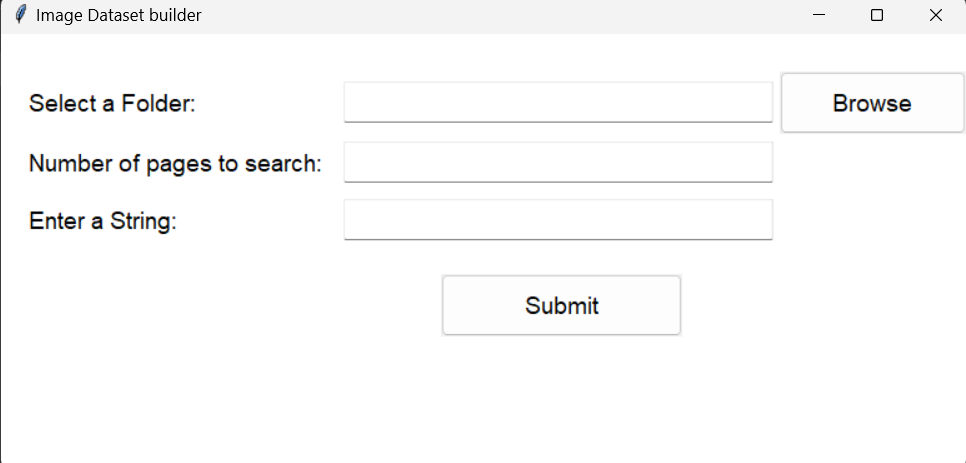

# Image Dataset Builder

**Note :** This project is still under developement. More features are being added.

## Description

The **Image Dataset Builder** is a versatile desktop application designed to streamline the process of creating image datasets for data analytics, machine learning, and deep learning projects using Python. This powerful tool empowers researchers, data scientists, and machine learning enthusiasts to effortlessly gather diverse sets of images from various online sources, all from the convenience of their desktop.

## Interface

### Key Features

- **Multi-Source Image Acquisition**:
  - The application provides access to a wide range of sources, including popular image repositories, search engines, and websites, allowing users to aggregate images from different platforms.

- **Custom Search Queries**:
  - Users can input custom search queries to specify the types of images they need, enabling precise and targeted dataset creation.

- **Download and Storage**:
  - The tool efficiently downloads images and stores them in an organized manner, ensuring easy access and management of the collected dataset.

- **Bulk Download and Parallel Processing**:
  - For scalability and speed, the tool supports bulk downloads and parallel processing of multiple sources simultaneously, saving valuable time.

- **User-Friendly Interface**:
  - The intuitive graphical user interface (GUI) makes it accessible to users with varying levels of technical expertise.

Whether you're working on image classification, object detection, or any other machine learning task, the **Image Dataset Builder** is a valuable companion for effortlessly compiling comprehensive and tailored image datasets. It empowers users to focus on their data analytics and deep learning research, accelerating the development of robust and accurate machine learning models.
